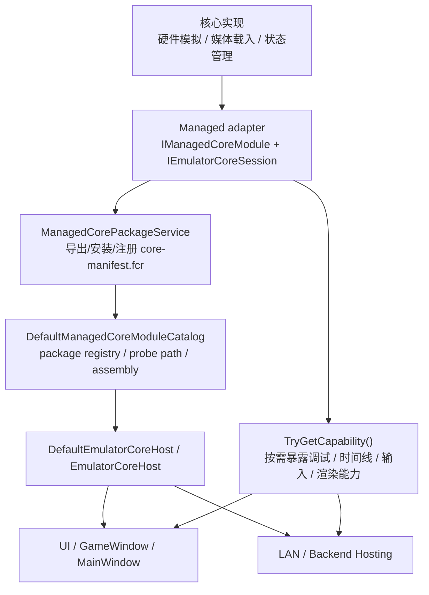

# FC-Revolution 新模拟器核心接入指南

本文档面向“准备新增一个模拟器核心”的开发者，目标不是只回答“把 DLL 放到哪里”，而是明确：

- 哪些能力必须先抽象成通用接口
- 哪些东西必须留在核心内部，不能泄漏到宿主
- 需要对接宿主、UI、后端的哪些系统入口
- 当前仓库里哪些文件可以直接作为实现参考

## 1. 总体原则

新增核心时，必须遵守下面三条：

1. 宿主、UI、后端只能依赖通用抽象，不能直接依赖系统专有类型。
2. 系统专有类型只能留在核心实现项目或显式 adapter 层。
3. 如果现有抽象不够，不要把新系统类型塞进公共层，而是先补新的通用 capability/interface。

反例：

- 把 `SfcButton`、`GbPpuState`、`MdVdpSnapshot` 暴露给 `FC-Revolution.UI`
- 让 `Backend` 直接知道某个核心的按钮枚举
- 让 `Rendering` 抽象层直接接收某系统的 PPU/VDP 类型

## 2. 新核心接入总流程



## 3. 先判断哪些东西要抽象出来

新增核心前，先做一轮“专有语义审计”。如果你的新核心依赖下面任一类东西，而公共层还没有对应抽象，就应先抽象：

### 3.1 媒体载入语义

当前公共入口是：

- `CoreMediaLoadRequest`
- `CoreLoadResult`
- `IEmulatorCoreSession.LoadMedia(...)`

如果新核心不是简单 ROM 文件，而是需要：

- 多文件介质
- BIOS
- 光盘镜像
- 软盘切换
- RTC/NVRAM 初始化

那就需要先扩展通用媒体载入抽象，而不是在 UI/Host 里写某系统特判。

### 3.2 输入模型

当前输入是 schema 驱动：

- `IInputSchema`
- `InputPortDescriptor`
- `InputActionDescriptor`
- `ICoreInputStateWriter.SetInputState(portId, actionId, value)`

如果新核心需要：

- 多控制器类型
- 模拟摇杆
- 鼠标/触笔/枪
- 热插拔外设

也应该继续走 `portId / actionId / valueKind` 模型，不要回退成按钮枚举直连 UI。

### 3.3 状态与时间线

当前公共模型是：

- `CoreStateBlob`
- `ITimeTravelService`
- `CoreTimelineSnapshot`
- `CoreBranchPoint`

如果你的核心需要特殊状态块、缩略图或回放策略，应由核心内部决定 blob 格式，再通过通用时间线接口暴露。

### 3.4 调试与反汇编

当前通用调试入口包括：

- `ICoreDebugSurface`
- `CoreDebugState`
- `debug-memory`
- `debug-registers`
- `disassembly`

如果新核心有专有寄存器或总线布局，不要把“CPU/PPU/VDP”类型直接泄漏出来，而是把调试输出映射到 `CoreDebugState` 一类的通用结构。

### 3.5 渲染元数据

如果新核心只提供最终帧，现有：

- `VideoFramePacket`

就够用。

如果宿主需要更高阶的分层重绘、运动矢量、图层元数据，则必须新增真正通用的 capability/interface。不要把某系统的 `Ppu`、`Vdp`、`GpuState` 放进 `Rendering.Abstractions`。

## 4. 必须实现的宿主接口

当前新增 managed core 最小需要对接这些抽象，定义见：

- `src/FC-Revolution.Emulation.Abstractions/CoreContracts.cs`

### 4.1 模块入口

你需要提供一个 `IManagedCoreModule`：

```csharp
public sealed class MySystemManagedCoreModule : IManagedCoreModule
{
    public CoreManifest Manifest { get; } = new(
        "my.system.managed",
        "My System Managed Core",
        "mysystem",
        "0.1.0",
        CoreBinaryKinds.ManagedDotNet);

    public IEmulatorCoreFactory CreateFactory() => new MySystemManagedCoreFactory(Manifest);
}
```

这里的 `CoreManifest` 会进入：

- 核心目录/安装注册
- UI 核心选择下拉框
- 默认核心选择逻辑
- 核心包导出/安装信息

### 4.2 会话工厂

你需要实现 `IEmulatorCoreFactory`，负责为宿主创建新的会话实例。

### 4.3 核心会话

你需要实现 `IEmulatorCoreSession`，至少完成：

- `RuntimeInfo`
- `Capabilities`
- `InputSchema`
- `LoadMedia`
- `Reset`
- `Pause`
- `Resume`
- `RunFrame`
- `StepInstruction`
- `CaptureState`
- `RestoreState`
- `TryGetCapability<T>()`
- `VideoFrameReady`
- `AudioReady`

当前宿主只认这一层，不应该知道你的核心内部是什么 CPU、PPU 或设备树。

## 5. 建议的核心目录结构

按当前仓库的收敛方向，一个模拟器核心应该尽量只占一个根目录，例如：

```text
src/FC-Revolution.Core/FC-Revolution.Core.MySystem/
├── FC-Revolution.Core.MySystem.csproj
├── CPU/
├── GPU/
├── Audio/
├── Media/
├── State/
├── Timeline/
└── Managed/
    ├── FC-Revolution.Core.MySystem.Managed.csproj
    ├── MySystemManagedCoreModule.cs
    └── Adapters/
```

这里的分层建议是：

- 根目录：系统专有 engine 实现
- `Managed/`：把 engine 映射为宿主抽象的适配层

这样既满足“每个核心一个文件夹”，也不会把 engine 与 host adapter 混成一个项目。

## 6. 需要对接的系统入口

### 6.1 核心发现与加载

相关文件：

- `src/FC-Revolution.Emulation.Host/DefaultManagedCoreModuleCatalog.cs`
- `src/FC-Revolution.Emulation.Host/ManagedCoreModuleRegistrationSource.cs`
- `src/FC-Revolution.Emulation.Host/EmulatorCoreHost.cs`
- `src/FC-Revolution.UI/Program.cs`

要点：

- 你的模块要能被 `IManagedCoreModule` 发现。
- 需要支持从 assembly、probe path 或 package registry 被加载。
- `DefaultEmulatorCoreHost.Create().CreateSession(...)` 必须能创建你的会话。

### 6.2 核心包导出、安装、卸载

相关文件：

- `src/FC-Revolution.Emulation.Host/ManagedCorePackageService.cs`
- `src/FC-Revolution.UI/ViewModels/MainWindow/MainWindowManagedCoreInstallController.cs`
- `src/FC-Revolution.UI/ViewModels/MainWindow/MainWindowManagedCoreExportController.cs`

要点：

- managed core 最终要能被导出为带 `core-manifest.fcr` 的核心包。
- 入口程序集路径和模块类型名必须可解析。
- `CoreManifest` 中的 `CoreId / Version / BinaryKind` 会进入安装注册表。

### 6.3 核心目录与设置页

相关文件：

- `src/FC-Revolution.UI/ViewModels/MainWindow/MainWindowManagedCoreCatalogController.cs`
- `src/FC-Revolution.UI/ViewModels/MainWindowViewModel.cs`
- `src/FC-Revolution.UI/Views/Settings/MainWindowCoreSettingsView.axaml`

要点：

- 核心要能出现在 Installed Core 列表里。
- 默认核心选择必须能切到你的 `CoreId`。
- 资源根目录切换、probe path 探测后，catalog 应能重新发现你的核心。

### 6.4 游戏会话、主窗口和预览

相关文件：

- `src/FC-Revolution.UI/Infrastructure/GameSessionRegistry.cs`
- `src/FC-Revolution.UI/ViewModels/GameWindowViewModel.cs`
- `src/FC-Revolution.UI/ViewModels/MainWindowViewModel.cs`
- `src/FC-Revolution.UI/ViewModels/MainWindow/MainWindowPreviewGenerationController.cs`

要点：

- 游戏窗口只依赖 `IEmulatorCoreSession`。
- 主窗口长期会话、预览生成会话、独立游戏会话都应能用你的核心创建。
- 如果预览生成依赖某能力，必须通过 capability 获取，而不是写系统分支。

### 6.5 后端、LAN 和远控

相关文件：

- `src/FC-Revolution.UI/Application/ArcadeRuntimeContractAdapter.cs`
- `src/FC-Revolution.UI/Application/SessionLifecycleService.cs`
- `src/FC-Revolution.UI/Application/SessionRemoteControlService.cs`
- `src/FC-Revolution.Backend.Hosting/BackendHostService.cs`

要点：

- 远控输入必须能通过 `portId / actionId` 驱动你的核心。
- 后端不应知道你的系统按钮枚举。
- 串流和预览继续依赖通用 `VideoFramePacket / AudioPacket`。

## 7. capability 设计建议

当前仓库已经有一批通用 capability：

- `video-frame`
- `audio-output`
- `save-state`
- `media-load`
- `input-schema`
- `input-state`
- `time-travel`
- `debug-memory`
- `debug-registers`
- `disassembly`
- `layered-frame`

接入新核心时，请按下面规则选择：

1. 如果通用 capability 已足够，直接实现它。
2. 如果语义相近但结构不同，优先扩展通用接口，而不是创建系统专有公共类型。
3. 只有当功能确实是系统专属、且宿主当前不会泛化消费时，才留在核心内部 adapter 层。

一个实用判断标准是：

- “这个接口以后第二个系统也有 30% 以上概率复用吗？”

如果答案是“有”，就应该做成公共抽象。

## 8. 参考实现

当前最直接的参考文件：

- `src/FC-Revolution.Core/FC-Revolution.Core.FC/Managed/NesManagedCoreModule.cs`
- `src/FC-Revolution.Core/FC-Revolution.Core.Sample.Managed/SampleManagedCoreModule.cs`
- `src/FC-Revolution.UI/Infrastructure/CoreSessionCapabilityResolver.cs`
- `src/FC-Revolution.Emulation.Host/Adapters/Nes/BundledManagedCoreBootstrapper.cs`

建议参考方式：

1. 先看 `SampleManagedCoreModule`，理解最小 managed core 形态。
2. 再看 `NesManagedCoreModule`，理解完整 capability、调试和时间线映射。
3. 最后看 Host/UI 的 catalog、install、export 和 session 创建链路。

## 9. 新增核心时的推荐检查单

### 9.1 核心侧

- 已有唯一 `CoreId`
- `SystemId` 明确
- `BinaryKind` 正确
- `IManagedCoreModule` 可发现
- `IEmulatorCoreSession` 最小方法全部实现
- `InputSchema` 不依赖宿主硬编码
- `CoreStateBlob.Format` 有稳定格式名
- `TryGetCapability<T>()` 只暴露通用 capability

### 9.2 宿主接入

- 可被 package registry 发现
- 可被 probe path 发现
- 可被 UI settings 列出
- 可设为默认核心
- 可创建主窗口会话
- 可创建预览会话
- 可创建游戏窗口会话
- LAN 远控可通过 `portId/actionId` 生效

### 9.3 验证

- focused host tests
- 核心自身单元测试
- 安装 / 导出 / 卸载流程测试
- solution build

## 10. 不建议再做的事情

新增核心时，不建议继续沿用下面这些老路：

1. 在 `UI` 里新增系统专属按钮枚举依赖。
2. 在 `Backend` 协议里新增某核心专属按钮字段。
3. 在 `Rendering.Abstractions` 里直接暴露某系统的 PPU/VDP/GPU 类型。
4. 让 `GameWindowViewModel` 或 `MainWindowViewModel` 直接依赖你的核心内部对象。
5. 用“先写系统特判，之后再抽象”作为默认路线。

如果一定要引入新能力，应该先问一句：

“这个能力能不能被整理成宿主可复用的抽象，而不是把新核心类型暴露到公共层？”
