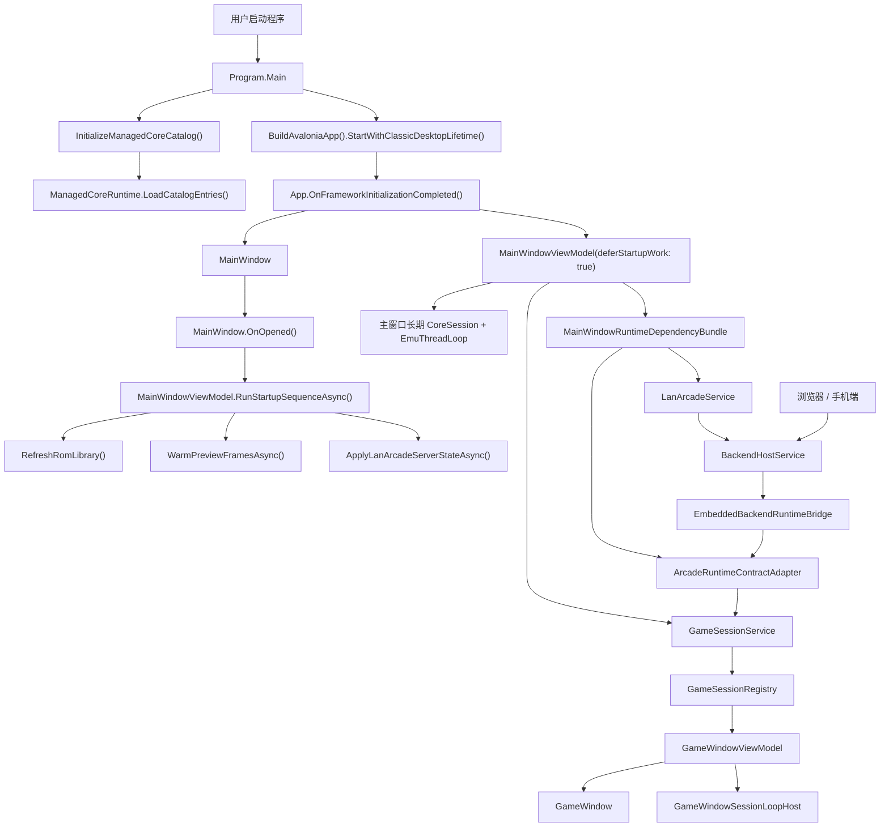
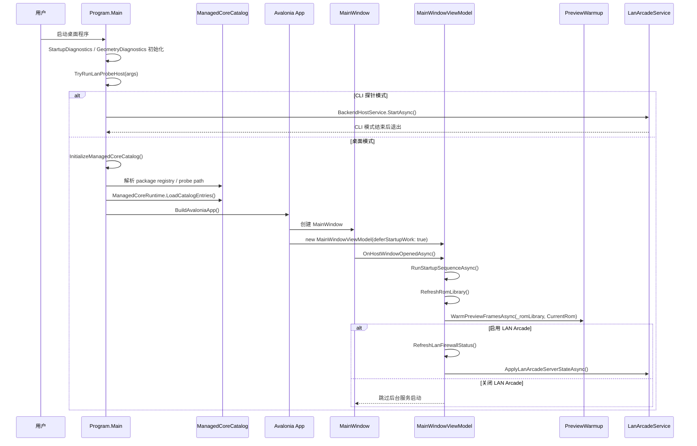
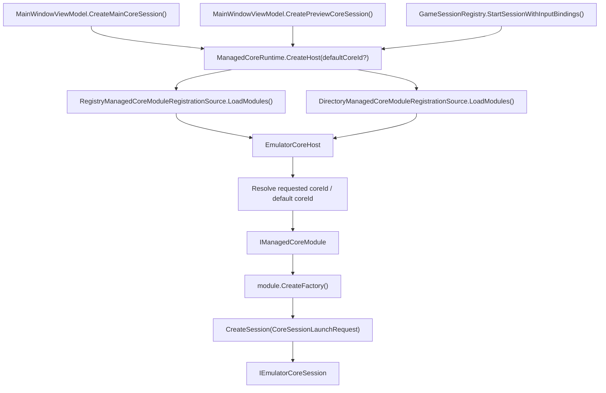
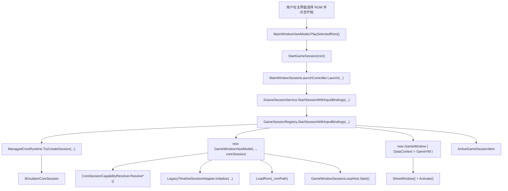
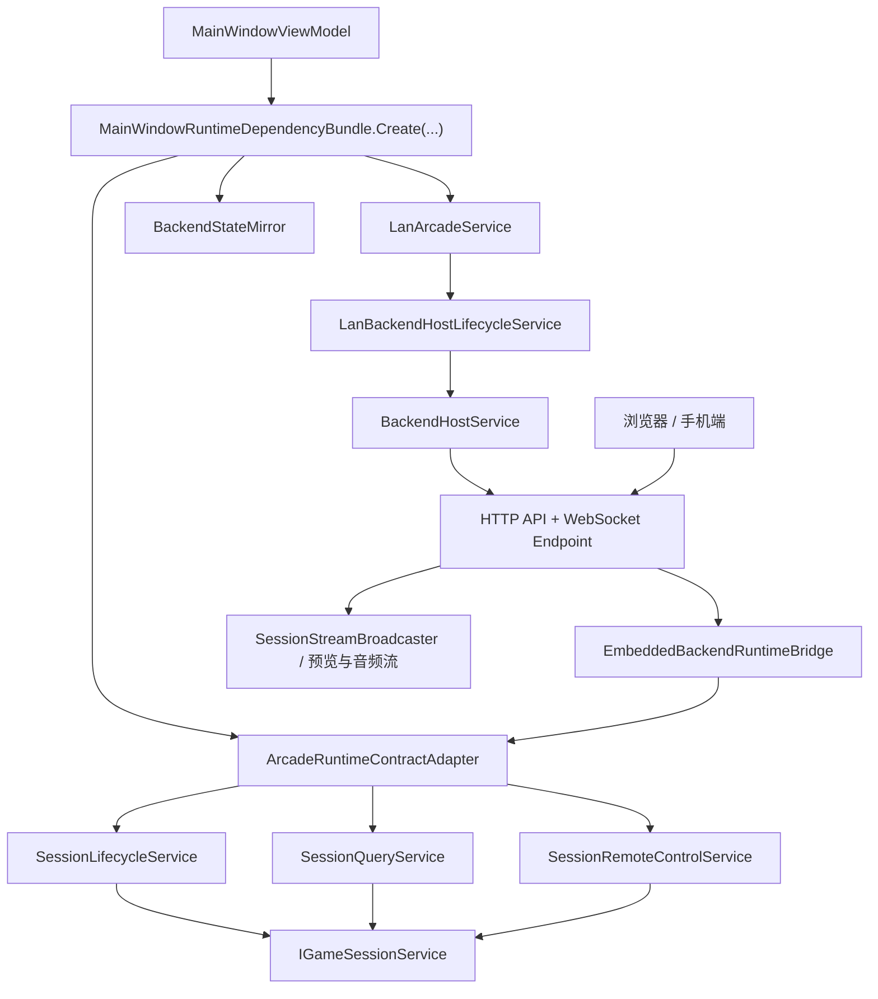
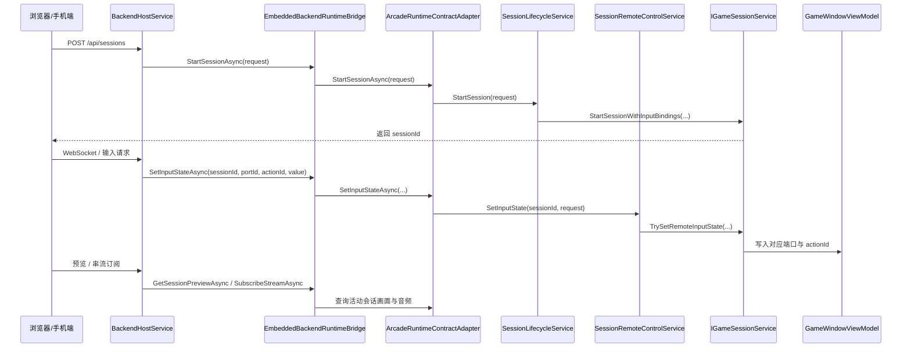

# FC-Revolution 当前整体运行流程图

本文档基于当前仓库实现，描述桌面应用默认运行路径，包括：

- 程序启动与主窗口延迟启动
- package-first 的核心发现与会话创建
- 从 ROM 选择到游戏窗口启动
- LAN Arcade 嵌入式后端与远控回流

当前架构下，核心发现已经是 package registry + probe path 驱动。桌面程序允许零核心启动；只有在存在可用核心时，主窗口/预览/独立游戏窗口才会通过统一的 `ManagedCoreRuntime` / `EmulatorCoreHost` 路径创建会话。默认核心不再写死为 NES，而是由配置决定；如果配置为空或无效，则回退到首个已安装核心。

## 1. 整体运行总览

## 2. 程序启动与主窗口延迟启动

启动时有两个并行感比较强的层次：

- `Program.Main` 先解析当前可用核心清单，再交给 Avalonia 建壳。
- `MainWindowViewModel` 构造时只搭服务图和长期资源，真正重活放到窗口 `Opened` 之后的 deferred startup sequence。

## 3. 核心发现与会话创建

这条链路说明了当前“核心只是挂件”的关键事实：

- UI、Host、后端调用的是 `IEmulatorCoreSession`、`CoreManifest`、`CoreSessionLaunchRequest` 这类通用抽象。
- 宿主只认识 package / probe / module / factory 这条通用路径，不再内建 NES 默认核心。
- 同一条装载链同时服务主窗口长期会话、预览生成会话和独立游戏窗口会话。

## 4. 从 ROM 选择到游戏窗口启动

游戏窗口启动后的核心职责大致如下：

- `GameSessionRegistry` 负责创建独立窗口、生命周期管理、窗口关闭清理和前台激活。
- `GameWindowViewModel` 负责 capability 解析、ROM 载入、帧呈现、音频、存档、时间线、远控与输入路由。
- 每个游戏窗口都有自己的 `IEmulatorCoreSession`，互不共享运行态。

## 5. LAN Arcade / 嵌入式后端运行链路

对应的请求回流可以理解为：

这部分的关键点是：

- 后端本身并不直接操纵 NES 类型，而是通过 `IBackendRuntimeBridge` 和通用 contract 回调 UI 运行时。
- 远控输入已经走 `portId` / `actionId` 语义，而不是要求后端知道某个核心的具体按钮枚举。
- `BackendHostService` 只负责托管 HTTP / WebSocket；实际 ROM、会话和输入逻辑都回流到 `ArcadeRuntimeContractAdapter` 及其下游服务。

## 6. 当前运行时的职责分层

| 层级 | 当前主要职责 | 代表实现 |
| --- | --- | --- |
| 程序入口层 | 诊断初始化、CLI 分支、Avalonia 启动、核心目录预注册 | `Program` |
| 应用壳层 | 创建桌面主窗口与主 ViewModel | `App`, `MainWindow` |
| 主窗口运行时 | ROM 库、预览、输入设置、LAN 配置、后台线程、状态同步 | `MainWindowViewModel` |
| 核心装载层 | 从 package/assembly/probe path 解析模块并创建会话 | `DefaultEmulatorCoreHost`, `EmulatorCoreHost`, `DefaultManagedCoreModuleCatalog` |
| 独立会话层 | 独立游戏窗口、会话生命周期、远控归属、预览快照 | `GameSessionService`, `GameSessionRegistry`, `GameWindowViewModel` |
| 嵌入式后端层 | HTTP/WebSocket 暴露、会话创建/关闭、远控输入、流订阅 | `LanArcadeService`, `BackendHostService`, `EmbeddedBackendRuntimeBridge`, `ArcadeRuntimeContractAdapter` |

## 7. 主要源码入口

- `src/FC-Revolution.UI/Program.cs`
- `src/FC-Revolution.UI/App.axaml.cs`
- `src/FC-Revolution.UI/Views/MainWindow.axaml.cs`
- `src/FC-Revolution.UI/ViewModels/MainWindowViewModel.cs`
- `src/FC-Revolution.UI/ViewModels/MainWindow/MainWindowViewModel.StartupSequence.cs`
- `src/FC-Revolution.UI/ViewModels/MainWindow/MainWindowViewModel.PreviewWarmup.cs`
- `src/FC-Revolution.UI/ViewModels/MainWindow/MainWindowViewModel.LanAndSessions.cs`
- `src/FC-Revolution.Emulation.Host/EmulatorCoreHost.cs`
- `src/FC-Revolution.UI/Application/GameSessionService.cs`
- `src/FC-Revolution.UI/Infrastructure/GameSessionRegistry.cs`
- `src/FC-Revolution.UI/ViewModels/GameWindowViewModel.cs`
- `src/FC-Revolution.UI/ViewModels/MainWindow/MainWindowRuntimeDependencyBundle.cs`
- `src/FC-Revolution.UI/Application/ArcadeRuntimeContractAdapter.cs`
- `src/FC-Revolution.UI/Application/SessionLifecycleService.cs`
- `src/FC-Revolution.UI/Application/LanArcadeService.cs`
- `src/FC-Revolution.UI/Application/EmbeddedBackendRuntimeBridge.cs`
- `src/FC-Revolution.Backend.Hosting/BackendHostService.cs`
